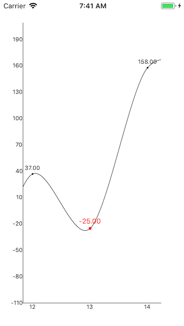
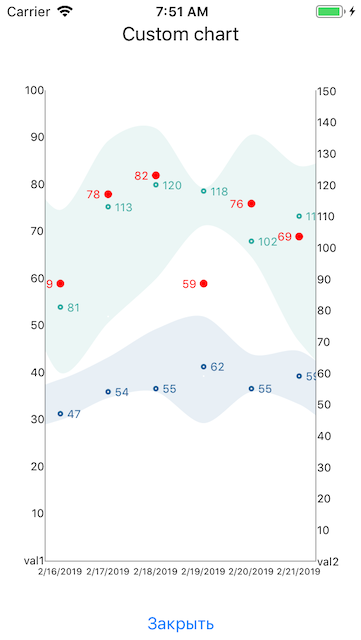

XCharts.iOS
=====

This is the lightweight C# chart rendering library for Xamarin iOS.

At this moment there are two _views_ of charts:
* __LineChartView__ - simple enough, used to display line charts. Allows you flexibly customize its style.
* __ChartView__ - allows you to display any type of charts by implementing custom render.

### [Documentation](https://github.com/iXamDev/xcharts/wiki)

---

### Samples
 

---
### Quick start

1. Install nuget package __XCharts.iOS__
2. Add _ChartView_ to View. You can do it in _xib_ or by code like:

```csharp
var lineChart = new LineChartView();

lineChart.TranslatesAutoresizingMaskIntoConstraints = false;

this.View.AddSubview(lineChart);

NSLayoutConstraint.ActivateConstraints(new NSLayoutConstraint[]
{
   lineChart.TopAnchor.ConstraintEqualTo(View.TopAnchor),
   lineChart.BottomAnchor.ConstraintEqualTo(View.BottomAnchor),
   lineChart.LeftAnchor.ConstraintEqualTo(View.LeftAnchor),
   lineChart.RightAnchor.ConstraintEqualTo(View.RightAnchor)
});
```

3. Set chart datasource:

```csharp
var points = new List<double>();
var r = new Random();
for (int i = 0; i < 1000; i++)
{
   points.Add(r.Next(0, 10000));
}

lineChart.DataSource = new IndexValueDataSource(points);
```
